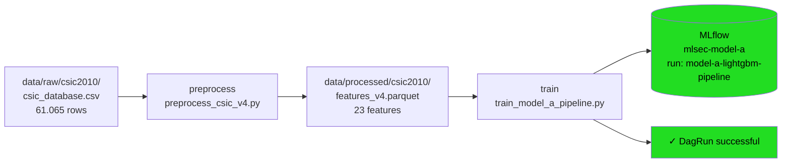

# Airflow — Setup y DAGs

Apache Airflow orquesta el pipeline de training: encadena preprocessing → training → evaluación y garantiza que cada paso se ejecute en orden, con logs y estado visible en la UI.

Hay dos formas de correrlo: **local** (desarrollo, tiene limitaciones en macOS ARM) y **Docker** (producción, recomendado).

---

## Docker — Setup de producción

### Estructura

```
docker/
├── Dockerfile.airflow        # apache/airflow:2.10.4 + libgomp1 + deps ML
├── Dockerfile.mlflow        # python:3.11-slim + mlflow 2.22.4
├── docker-compose.yml       # todos los servicios
├── init-dbs.sql            # crea DB mlflow en postgres
└── migrate_mlflow.py       # migración runs SQLite → Postgres
```

### Servicios

| Servicio | Puerto | Descripción |
|---|---|---|
| `postgres` | 5432 | Backend store compartido (Airflow + MLflow) |
| `mlflow` | 5081 | Tracking server MLflow 2.22.4 |
| `airflow-webserver` | 5080 | UI de Airflow (admin / admin) |
| `airflow-scheduler` | — | Ejecuta los DAGs |

### Cómo levantar

```bash
# Arrancar todo
cd docker && docker compose up

# Parar (preserva datos en volúmenes)
docker compose -f docker/docker-compose.yml down

# Limpiar todo incluyendo volúmenes
docker compose -f docker/docker-compose.yml down -v
```

UI: `http://localhost:5080` (admin / admin)  
MLflow: `http://localhost:5081`

### Migración de runs MLflow

Si hay runs en `mlflow.db` (SQLite local) y se quiere pasarlos al servidor Docker:

```bash
.venv/bin/python docker/migrate_mlflow.py
```

Esto migra: params, métricas, tags, run name, status. Los artefactos de modelo no se migran.

### Rebuild después de cambios

Si se modifica `requirements-ml.txt` o un Dockerfile:

```bash
docker compose -f docker/docker-compose.yml build [servicio]
docker compose -f docker/docker-compose.yml up -d --force-recreate [servicio]
```

---

## Local — Setup de desarrollo

### Requisitos

Airflow tiene un árbol de dependencias grande que puede chocar con scikit-learn y LightGBM. Se instala en un entorno separado:

```bash
python3.12 -m venv .venv-airflow
AIRFLOW_VERSION=2.10.4
PYTHON_VERSION=3.12
.venv-airflow/bin/pip install "apache-airflow==${AIRFLOW_VERSION}" \
    --constraint "https://raw.githubusercontent.com/apache/airflow/constraints-${AIRFLOW_VERSION}/constraints-${PYTHON_VERSION}.txt"
```

!!! note "Python 3.12 requerido"
    Airflow 2.10.4 no soporta Python 3.13 (versión del `.venv` principal).
    El entorno `.venv-airflow` usa Python 3.12 exclusivamente para Airflow.
    Los scripts de ML siguen corriendo con `.venv` (Python 3.13).

### Cómo levantar

Se necesitan **dos terminales**:

**Terminal 1 — webserver:**
```bash
AIRFLOW_HOME="$(pwd)/airflow" .venv-airflow/bin/airflow webserver --port 5080 --debug
```

**Terminal 2 — scheduler:**
```bash
AIRFLOW_HOME="$(pwd)/airflow" .venv-airflow/bin/airflow scheduler 2>&1 | grep -v "SIGSEGV\|Worker (pid"
```

UI: `http://localhost:5080` (admin / admin)

!!! warning "SIGSEGV en macOS ARM"
    En macOS Apple Silicon, el scheduler levanta un servidor de logs interno (puerto 8793) que crashea con `fork()`. No afecta la ejecución de los DAGs. Para desarrollo local usar Docker (ver arriba) si los DAGs no corren.

### Configuración aplicada

En `airflow/airflow.cfg`:

| Parámetro | Valor | Razón |
|---|---|---|
| `dags_folder` | `<root>/dags/` | Apunta a la carpeta del proyecto |
| `load_examples` | `False` | Evita cargar los DAGs de ejemplo |
| `workers` | `1` | macOS ARM — evita crashes de gunicorn |
| `worker_class` | `gthread` | macOS ARM — evita crashes de gunicorn |

---

## DAG — dag_model_a

**Archivo:** `dags/dag_model_a.py`
**Trigger:** manual (`schedule=None`)
**Tags:** `model-a`, `csic2010`

### Flujo de datos



### Tareas en detalle

#### `verify_data` — PythonOperator

Verifica que el dataset crudo existe y tiene contenido antes de procesar. Si el archivo falta, falla inmediatamente sin dejar un parquet vacío.

```python
def check_raw_data():
    if not DATA_RAW.exists():
        raise FileNotFoundError(...)
    size_mb = DATA_RAW.stat().st_size / 1024 / 1024
    print(f"Dataset encontrado: {DATA_RAW} ({size_mb:.1f} MB)")
```

**Input:** `data/raw/csic2010/csic_database.csv` (~60 MB)  
**Output:** log stdout confirmando existencia  
**Falla si:** el archivo no existe o está vacío

---

#### `preprocess` — BashOperator

Ejecuta `preprocess_csic_v4.py` dentro del intérprete de Python del contenedor. Genera el parquet de features listo para training.

```bash
python3 /opt/airflow/src/mlsec/data/preprocess_csic_v4.py
```

**Script:** `src/mlsec/data/preprocess_csic_v4.py`  
**Input:** `data/raw/csic2010/csic_database.csv`  
**Output:** `data/processed/csic2010/features_v4.parquet` (23 features + label)  
**Falla si:** el CSV no existe, tiene formato inesperado, o falla la serialización del parquet

**Features generadas:**

| Feature | Tipo | Descripción |
|---|---|---|
| `url_length` | continua | Longitud de URL |
| `url_query_length` | continua | Longitud del query string |
| `content_length` | continua | Longitud del body |
| `method_is_get` | binaria | GET = 1 |
| `method_is_post` | binaria | POST = 1 |
| `method_is_put` | binaria | PUT = 1 (100% ataques) |
| `url_pct27`, `url_pct3c`, ... | binaria | Indicadores %XX URL-encoded |
| `content_param_count` | entera | Count de `=` en body |
| `content_param_density` | continua | `content_param_count / content_length` |
| 11 features más | ... | Ver `docs/model_a/v6.md` |

---

#### `train` — BashOperator

Ejecuta `train_model_a_pipeline.py`. Esta es la tarea principal — entrena el modelo, calibra el threshold, y loggea todo en MLflow.

```bash
python3 /opt/airflow/src/mlsec/models/train_model_a_pipeline.py \
    --features /opt/airflow/data/processed/csic2010/features_v4.parquet \
    --min-recall 0.955
```

**Script:** `src/mlsec/models/train_model_a_pipeline.py`

**Pipeline interno:**

```
Parquet → Split 70/15/15 → Scale (solo continuas)
    → LightGBM (scale_pos_weight)
    → Calibrar threshold en val (min_recall_val=0.955)
    → Evaluar en test
    → Loggear en MLflow
    → Exit 0 o 1
```

**Split estratificado (seed=42):**

| Set | Filas | Propósito |
|---|---|---|
| Train | 42.745 | Ajuste del modelo |
| Val | 9.160 | Calibración del threshold |
| Test | 9.160 | Evaluación final (reported) |

**LightGBM config:**

```python
LGBMClassifier(
    n_estimators=200,
    scale_pos_weight=neg/pos,   # ~1.44 (desbalance leve 59/41)
    random_state=42,
    n_jobs=-1,
    verbose=-1,
)
```

**Calibración de threshold:**

```
find_best_threshold(y_val, val_proba, min_recall=0.955)
→ busca el threshold que maximiza Precision
   manteniendo Recall >= 0.955 en val
```

Resultado: threshold = **0.2903** (vs default 0.5)

**Qué se loggea en MLflow:**

| Tipo | Contenido |
|---|---|
| Params | `model`, `n_features=23`, `min_recall_val=0.955`, `threshold=0.2903`, `random_state=42` |
| Métricas | `test_recall=0.9548`, `test_precision=0.7928`, `test_roc_auc=0.9661`, `test_fp=938` |
| Artefacto | `model/` — modelo serializado con `mlflow.sklearn.log_model()` |

**Exit codes:**

| Exit | Condición | Efecto en Airflow |
|---|---|---|
| `0` | Recall test ≥ 0.95 | Tarea verde ✅ |
| `1` | Recall test < 0.95 | Tarea roja ❌, DagRun fallido |

**Métricas del último run:**

```
ROC-AUC:   0.9661
Recall:    0.9548 ✅
Precision: 0.7928
FP:        938
```

**Falla si:** el parquet no existe, LightGBM falla, o MLflow no puede loggear.

---

#### `evaluate` — BashOperator

Verifica que el parquet de features quedó generado correctamente. No reentrena ni evalúa — es un checkpoint sanitario.

```python
df = pd.read_parquet('/opt/airflow/data/processed/csic2010/features_v4.parquet')
print(f'features_v4.parquet: {df.shape[0]} filas, {df.shape[1]-1} features')
print('Pipeline completado exitosamente.')
```

**Input:** `features_v4.parquet`  
**Output:** log stdout con shape del dataset  
**Falla si:** el archivo no fue generado por `preprocess`

---

### Cómo triggerear

1. Entrá a `http://localhost:5080`
2. Buscá `dag_model_a`
3. Activá el toggle (arranca pausado por defecto)
4. Click en **▶ Trigger DAG**
5. Monitoreá en Graph o Grid

---

### Dependencias entre tareas

```
verify_data  →  preprocess  →  train  →  evaluate
```

Si `verify_data` o `preprocess` falla, `train` no corre (dependencia implícita por orden). Si `train` falla, `evaluate` no corre.

---

### Logs de tareas

Cada tarea escribe su stdout/stderr a:

```
airflow-logs/
└── dag_model_a/
    └── run_id=manual__2026-04-13T15:30:57.458592+00:00/
        ├── task_id=verify_data/attempt=1.log
        ├── task_id=preprocess/attempt=1.log
        ├── task_id=train/attempt=6.log   ← retries por fallos previos
        └── task_id=evaluate/attempt=1.log
```

En Docker: `docker exec pmtmlsec-airflow-scheduler-1 cat /opt/airflow/logs/...`  
En local: `airflow/logs/`

---

### Variables de entorno relevantes

| Variable | Valor en Docker | Efecto |
|---|---|---|
| `MLFLOW_TRACKING_URI` | `http://mlflow:5000` | Cliente MLflow apunta al servidor |
| `MLSEC_PYTHON` | `python3` | Intérprete para BashOperators |
| `PYTHONPATH` | `/opt/airflow/src` | Permite imports de `src/mlsec/` |

En local: `MLFLOW_TRACKING_URI` no está seteada → usa `sqlite:///mlflow.db` por default.

---

### Resultados en MLflow

Cada ejecución del DAG loggea un run en el experimento `mlsec-model-a` con nombre `model-a-lightgbm-pipeline`.

En Docker: `http://localhost:5081` → experimento `mlsec-model-a` → runs  
En local: `mlflow ui --backend-store-uri sqlite:///mlflow.db`

**Runs acumulativos (2026-04-13):** 40 runs — 20 migrados de SQLite + 19 de notebooks + 1 del DAG.

---

## Estructura de archivos

```
docker/
├── Dockerfile.airflow        # apache/airflow:2.10.4 + libgomp1 + deps ML
├── Dockerfile.mlflow        # python:3.11-slim + mlflow 2.22.4
├── docker-compose.yml       # servicios
├── init-dbs.sql            # DB mlflow en postgres
└── migrate_mlflow.py       # migración runs SQLite → Postgres

dags/
└── dag_model_a.py          ← DAG de Airflow

src/mlsec/
├── data/
│   └── preprocess_csic_v4.py   ← Preprocessing (genera features_v4.parquet)
└── models/
    └── train_model_a_pipeline.py  ← Training + MLflow (invocado por DAG)

data/
├── raw/csic2010/
│   └── csic_database.csv        ← Dataset original (NO se modifica)
└── processed/csic2010/
    └── features_v4.parquet      ← Features generadas por preprocess

airflow/                    ← Runtime local (no versionado)
├── airflow.cfg
├── airflow.db
└── logs/

mlflow.db                   ← SQLite local (no versionado)
```
