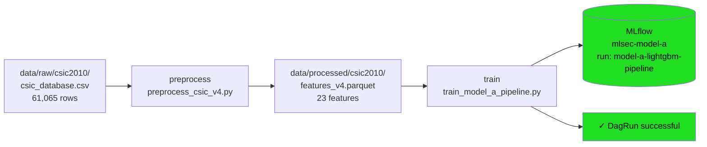

# Airflow — Setup and DAGs

Apache Airflow orchestrates the training pipeline: chains preprocessing → training → evaluation and ensures each step runs in order, with logs and state visible in the UI.

There are two ways to run it: **local** (development, has limitations on macOS ARM) and **Docker** (production, recommended).

---

## Docker — Production Setup

### Structure

```
docker/
├── Dockerfile.airflow        # apache/airflow:2.10.4 + libgomp1 + ML deps
├── Dockerfile.mlflow        # python:3.11-slim + mlflow 2.22.4
├── docker-compose.yml       # all services
├── init-dbs.sql            # creates mlflow DB in postgres
└── migrate_mlflow.py       # migrates SQLite runs → Postgres
```

### Services

| Service | Port | Description |
|---|---|---|
| `postgres` | 5432 | Shared backend store (Airflow + MLflow) |
| `mlflow` | 5081 | MLflow tracking server 2.22.4 |
| `airflow-webserver` | 5080 | Airflow UI (admin / admin) |
| `airflow-scheduler` | — | Executes DAGs |

### How to start

```bash
# Start everything
cd docker && docker compose up

# Stop (preserves data in volumes)
docker compose -f docker/docker-compose.yml down

# Clean everything including volumes
docker compose -f docker/docker-compose.yml down -v
```

UI: `http://localhost:5080` (admin / admin)  
MLflow: `http://localhost:5081`

### MLflow run migration

If there are runs in `mlflow.db` (local SQLite) and you want to move them to the Docker server:

```bash
.venv/bin/python docker/migrate_mlflow.py
```

This migrates: params, metrics, tags, run name, status. Model artifacts are not migrated.

### Rebuild after changes

If `requirements-ml.txt` or a Dockerfile is modified:

```bash
docker compose -f docker/docker-compose.yml build [service]
docker compose -f docker/docker-compose.yml up -d --force-recreate [service]
```

---

## Local — Development Setup

### Requirements

Airflow has a large dependency tree that can conflict with scikit-learn and LightGBM. It is installed in a separate environment:

```bash
python3.12 -m venv .venv-airflow
AIRFLOW_VERSION=2.10.4
PYTHON_VERSION=3.12
.venv-airflow/bin/pip install "apache-airflow==${AIRFLOW_VERSION}" \
    --constraint "https://raw.githubusercontent.com/apache/airflow/constraints-${AIRFLOW_VERSION}/constraints-${PYTHON_VERSION}.txt"
```

!!! note "Python 3.12 required"
    Airflow 2.10.4 does not support Python 3.13 (version of the main `.venv`).
    The `.venv-airflow` environment uses Python 3.12 exclusively for Airflow.
    ML scripts keep running with `.venv` (Python 3.13).

### How to start

**Two terminals** are needed:

**Terminal 1 — webserver:**
```bash
AIRFLOW_HOME="$(pwd)/airflow" .venv-airflow/bin/airflow webserver --port 5080 --debug
```

**Terminal 2 — scheduler:**
```bash
AIRFLOW_HOME="$(pwd)/airflow" .venv-airflow/bin/airflow scheduler 2>&1 | grep -v "SIGSEGV\|Worker (pid"
```

UI: `http://localhost:5080` (admin / admin)

!!! warning "SIGSEGV on macOS ARM"
    On Apple Silicon macOS, the scheduler starts an internal log server (port 8793) that crashes with `fork()`. It doesn't affect DAG execution. For local development use Docker (see above) if DAGs don't run.

### Applied configuration

In `airflow/airflow.cfg`:

| Parameter | Value | Reason |
|---|---|---|
| `dags_folder` | `<root>/dags/` | Points to the project folder |
| `load_examples` | `False` | Prevents loading example DAGs |
| `workers` | `1` | macOS ARM — prevents gunicorn crashes |
| `worker_class` | `gthread` | macOS ARM — prevents gunicorn crashes |

---

## DAG — dag_model_a

**File:** `dags/dag_model_a.py`
**Trigger:** manual (`schedule=None`)
**Tags:** `model-a`, `csic2010`

### Data flow


```mermaid
flowchart LR
    A["data/raw/csic2010/\ncsic_database.csv\n61,065 rows"] --> B["preprocess\npreprocess_csic_v4.py"]
    B --> C["data/processed/csic2010/\nfeatures_v4.parquet\n23 features"]
    C --> D["train\ntrain_model_a_pipeline.py"]
    D --> E[("MLflow\nmlsec-model-a\nrun: model-a-lightgbm-pipeline")]
    D --> F["✓ DagRun successful"]
    style E fill:#2d2,color:#000
    style F fill:#2d2,color:#000
```

### Detailed tasks

#### `verify_data` — PythonOperator

Verifies that the raw dataset exists and has content before processing. If the file is missing, it fails immediately without leaving an empty parquet.

```python
def check_raw_data():
    if not DATA_RAW.exists():
        raise FileNotFoundError(...)
    size_mb = DATA_RAW.stat().st_size / 1024 / 1024
    print(f"Dataset found: {DATA_RAW} ({size_mb:.1f} MB)")
```

**Input:** `data/raw/csic2010/csic_database.csv` (~60 MB)  
**Output:** stdout log confirming existence  
**Fails if:** file does not exist or is empty

---

#### `preprocess` — BashOperator

Runs `preprocess_csic_v4.py` inside the container's Python interpreter. Generates the feature parquet ready for training.

```bash
python3 /opt/airflow/src/mlsec/data/preprocess_csic_v4.py
```

**Script:** `src/mlsec/data/preprocess_csic_v4.py`  
**Input:** `data/raw/csic2010/csic_database.csv`  
**Output:** `data/processed/csic2010/features_v4.parquet` (23 features + label)  
**Fails if:** CSV does not exist, has unexpected format, or parquet serialization fails

**Generated features:**

| Feature | Type | Description |
|---|---|---|
| `url_length` | continuous | URL length |
| `url_query_length` | continuous | Query string length |
| `content_length` | continuous | Body length |
| `method_is_get` | binary | GET = 1 |
| `method_is_post` | binary | POST = 1 |
| `method_is_put` | binary | PUT = 1 (100% attacks) |
| `url_pct27`, `url_pct3c`, ... | binary | %XX URL-encoded indicators |
| `content_param_count` | integer | Count of `=` in body |
| `content_param_density` | continuous | `content_param_count / content_length` |
| 11 more features | ... | See `docs/model_a/v6.md` |

---

#### `train` — BashOperator

Runs `train_model_a_pipeline.py`. This is the main task — trains the model, calibrates the threshold, and logs everything in MLflow.

```bash
python3 /opt/airflow/src/mlsec/models/train_model_a_pipeline.py \
    --features /opt/airflow/data/processed/csic2010/features_v4.parquet \
    --min-recall 0.955
```

**Script:** `src/mlsec/models/train_model_a_pipeline.py`

**Internal pipeline:**

```
Parquet → Split 70/15/15 → Scale (continuous only)
    → LightGBM (scale_pos_weight)
    → Calibrate threshold on val (min_recall_val=0.955)
    → Evaluate on test
    → Log to MLflow
    → Exit 0 or 1
```

**Stratified split (seed=42):**

| Set | Rows | Purpose |
|---|---|---|
| Train | 42,745 | Model fitting |
| Val | 9,160 | Threshold calibration |
| Test | 9,160 | Final evaluation (reported) |

**LightGBM config:**

```python
LGBMClassifier(
    n_estimators=200,
    scale_pos_weight=neg/pos,   # ~1.44 (mild imbalance 59/41)
    random_state=42,
    n_jobs=-1,
    verbose=-1,
)
```

**Threshold calibration:**

```
find_best_threshold(y_val, val_proba, min_recall=0.955)
→ finds the threshold that maximizes Precision
   while maintaining Recall >= 0.955 on val
```

Result: threshold = **0.2903** (vs default 0.5)

**What is logged in MLflow:**

| Type | Content |
|---|---|
| Params | `model`, `n_features=23`, `min_recall_val=0.955`, `threshold=0.2903`, `random_state=42` |
| Metrics | `test_recall=0.9548`, `test_precision=0.7928`, `test_roc_auc=0.9661`, `test_fp=938` |
| Artifact | `model/` — serialized model with `mlflow.sklearn.log_model()` |

**Exit codes:**

| Exit | Condition | Airflow Effect |
|---|---|---|
| `0` | Test Recall ≥ 0.95 | Green task ✅ |
| `1` | Test Recall < 0.95 | Red task ❌, DagRun failed |

**Last run metrics:**

```
ROC-AUC:   0.9661
Recall:    0.9548 ✅
Precision: 0.7928
FP:        938
```

**Fails if:** parquet does not exist, LightGBM fails, or MLflow cannot log.

---

#### `evaluate` — BashOperator

Verifies that the feature parquet was generated correctly. It does not retrain or evaluate — it's a sanity checkpoint.

```python
df = pd.read_parquet('/opt/airflow/data/processed/csic2010/features_v4.parquet')
print(f'features_v4.parquet: {df.shape[0]} rows, {df.shape[1]-1} features')
print('Pipeline completed successfully.')
```

**Input:** `features_v4.parquet`  
**Output:** stdout log with dataset shape  
**Fails if:** the file was not generated by `preprocess`

---

### How to trigger

1. Go to `http://localhost:5080`
2. Search for `dag_model_a`
3. Toggle it on (starts paused by default)
4. Click **▶ Trigger DAG**
5. Monitor in Graph or Grid

---

### Task dependencies

```
verify_data  →  preprocess  →  train  →  evaluate
```

If `verify_data` or `preprocess` fails, `train` doesn't run (implicit dependency by order). If `train` fails, `evaluate` doesn't run.

---

### Task logs

Each task writes its stdout/stderr to:

```
airflow-logs/
└── dag_model_a/
    └── run_id=manual__2026-04-13T15:30:57.458592+00:00/
        ├── task_id=verify_data/attempt=1.log
        ├── task_id=preprocess/attempt=1.log
        ├── task_id=train/attempt=6.log   ← retries due to previous failures
        └── task_id=evaluate/attempt=1.log
```

In Docker: `docker exec pmtmlsec-airflow-scheduler-1 cat /opt/airflow/logs/...`  
Local: `airflow/logs/`

---

### Relevant environment variables

| Variable | Value in Docker | Effect |
|---|---|---|
| `MLFLOW_TRACKING_URI` | `http://mlflow:5000` | MLflow client points to the server |
| `MLSEC_PYTHON` | `python3` | Interpreter for BashOperators |
| `PYTHONPATH` | `/opt/airflow/src` | Allows imports from `src/mlsec/` |

Local: `MLFLOW_TRACKING_URI` is not set → defaults to `sqlite:///mlflow.db`.

---

### MLflow Results

Each DAG execution logs a run in the `mlsec-model-a` experiment named `model-a-lightgbm-pipeline`.

In Docker: `http://localhost:5081` → experiment `mlsec-model-a` → runs  
Local: `mlflow ui --backend-store-uri sqlite:///mlflow.db`

**Cumulative runs (2026-04-13):** 40 runs — 20 migrated from SQLite + 19 from notebooks + 1 from DAG.

---

## File structure

```
docker/
├── Dockerfile.airflow        # apache/airflow:2.10.4 + libgomp1 + ML deps
├── Dockerfile.mlflow        # python:3.11-slim + mlflow 2.22.4
├── docker-compose.yml       # services
├── init-dbs.sql            # mlflow DB in postgres
└── migrate_mlflow.py       # SQLite runs → Postgres migration

dags/
└── dag_model_a.py          ← Airflow DAG

src/mlsec/
├── data/
│   └── preprocess_csic_v4.py   ← Preprocessing (generates features_v4.parquet)
└── models/
    └── train_model_a_pipeline.py  ← Training + MLflow (invoked by DAG)

data/
├── raw/csic2010/
│   └── csic_database.csv        ← Original dataset (NOT modified)
└── processed/csic2010/
    └── features_v4.parquet      ← Features generated by preprocess

airflow/                    ← Local runtime (not versioned)
├── airflow.cfg
├── airflow.db
└── logs/

mlflow.db                   ← Local SQLite (not versioned)
```
