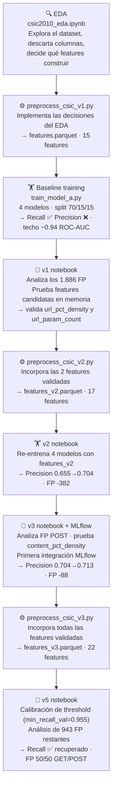

# Modelo A — Web Attack Detection

**Dataset:** CSIC 2010  
**Input:** Features de requests HTTP  
**Output:** `0` normal / `1` attack

---

## Pipeline completo

Cada paso tiene un rol específico en la cadena. Ninguno se saltea — cada uno responde una pregunta distinta antes de pasar al siguiente.



**Tipos de pasos:**

| Tipo | Rol | Vive en |
|---|---|---|
| **EDA** | Exploración sin modelo — decide qué features construir | `notebooks/eda/` |
| **Preprocessing** | Implementa las decisiones del EDA en código reproducible | `src/mlsec/data/` |
| **Training / Experimento** | Entrena modelos, mide métricas, analiza errores, decide próximo paso | `notebooks/experiments/` / `src/mlsec/models/` |

---

## Criterios de éxito MVP

| Métrica | Mínimo |
|---|---|
| Recall | ≥ 0.95 |
| Precision | ≥ 0.85 |

---

## Progresión de métricas

Evolución del mejor modelo (RF / LightGBM) a lo largo de los experimentos:

| Versión | ROC-AUC | Recall | Precision | FP | Estado |
|---|---|---|---|---|---|
| Baseline | 0.939 | 0.951 | 0.655 | 1886 | ❌ |
| v2 — url_pct_density + url_param_count | 0.950 | 0.950 | 0.704 | 1504 | ❌ |
| v3 — content_pct_density | 0.955 | 0.952 | 0.713 | 1444 | ❌ |
| v4 — URL structure (GET) | 0.966 | 0.949 | 0.803 | 877 | ❌ |
| v5 — Calibración threshold | 0.966 | **0.956 ✅** | 0.792 | 943 | ❌ |
| v6 — content_param_density | 0.966 | 0.955 ✅ | 0.793 | 938 | ❌ |
| v7 — Latin-1 encoding | 0.968 | 0.953 ✅ | 0.793 | 936 | ❌ |
| **Target** | — | **0.95** | **0.85** | ~630 | — |

---

## Experimentos

| Página | Qué hizo | Resultado |
|---|---|---|
| [Baseline](baseline.md) | 4 modelos entrenados con 15 features del EDA | Feature ceiling ~0.94 ROC-AUC |
| [v1 — Análisis de features](v1.md) | FP analysis + 4 features candidatas evaluadas | `url_pct_density` y `url_param_count` → señal validada |
| [v2 — URL features](v2.md) | 4 modelos re-entrenados con 17 features | Precision 0.655 → 0.704 (+0.049), FP -382 |
| [v3 — Content POST + MLflow](v3.md) | `content_pct_density`, primera integración MLflow | Precision 0.704 → 0.713 (+0.012), FP -88 |
| [v4 — URL structure GET](v4.md) | `url_path_depth`, `url_query_length`, `url_has_query` | Precision 0.713 → 0.803 (+0.090), FP -567, ROC-AUC 0.966 |
| [v5 — Calibración threshold](v5.md) | `min_recall_val=0.955` — sin features nuevas | Recall 0.9492 → 0.9556 ✅, FP 877→943 (+66), gap Precision 0.047→0.058 |
| [v6 — content_param_density](v6.md) | `content_param_count / content_length` — subpoblación POST | Precision +0.0007, FP -5. Root cause identificado: confusión Latin-1 vs encoding de ataque |
| [v7 — Latin-1 encoding](v7.md) | `content_pct_latin1_density`, `url_pct_latin1_density` | Hipótesis no confirmada. Ataques también tienen Latin-1 (generados contra tienda española). FP -2 |

---

## Pipeline de preprocessing

| Script | Dataset generado | Features | Cambio |
|---|---|---|---|
| `preprocess_csic_v1.py` | `features.parquet` | 15 + label | Versión original |
| `preprocess_csic_v2.py` | `features_v2.parquet` | 17 + label | + `url_pct_density`, `url_param_count` |
| `preprocess_csic_v3.py` | `features_v3.parquet` | 22 + label | + `url_path_depth`, `url_query_length`, `url_has_query`, `content_pct_density`, `content_param_count` |
| **`preprocess_csic_v4.py`** | **`features_v4.parquet`** | **23 + label** | + `content_param_density` — **versión final** |

---

## Estado actual — Modelo A concluido

**Decisión (2026-04-13):** se acepta Precision ~0.793 como techo práctico del enfoque actual y se avanza a Modelo B.

### Recorrido de v5 a v7

**v5** resolvió Recall: LightGBM 0.9556 ✅. Costo: +66 FP (877→943), Precision 0.7921. El threshold óptimo fue `min_recall_val=0.955` encontrado mediante sweep 0.950–0.985.

**v6** validó `content_param_density` (corr POST -0.216, rank 6) — impacto marginal (-5 FP). La inspección del CSV crudo reveló el **root cause** de los FP:

> El modelo confunde **encoding Latin-1** (vocales acentuadas españolas: `%F1`=ñ, `%ED`=í, `%FA`=ú) con **encoding de ataque** (`%27`=', `%3C`=<). La feature `content_pct_density` cuenta todos los `%XX` por igual. Los FP son formularios legítimos de una tienda española — apellidos como `Murgu%EDa`, contraseñas como `lIMpi%24a%FA%F1as`.

**v7** probó `content_pct_latin1_density` y `url_pct_latin1_density` para separar Latin-1 inofensivo de encoding de ataque. **Hipótesis no confirmada:** el generador de ataques de CSIC 2010 construye requests contra una tienda española e incluye nombres de campo con caracteres acentuados — los ataques tienen Latin-1 al mismo ritmo que el tráfico normal (media POST: 0.00413 ataque vs 0.00420 normal). Correlación content POST: -0.004. FP 938→936 (-2).

### Por qué se acepta el techo

| Dimensión analizada | Resultado |
|---|---|
| Longitud y estructura de URL/body | Agotado desde v4 |
| Indicadores de keywords (`%27`, `SELECT`) | 98.6% de FP sin ninguno |
| Estructura de query string | Mejoró v4, agotado |
| Densidad de parámetros (`content_param_density`) | Señal real pero marginal |
| Encoding Latin-1 vs ataque | Sin separación — ataques también tienen Latin-1 |
| Headers HTTP (`cookie`, `content-type`) | Sin señal — constantes en el dataset |

Los 936 FP son requests normales que el modelo no puede diferenciar de ataques con features de campos HTTP individuales. Cerrar el gap requeriría parseo semántico de valores de parámetros o features de sesión — un enfoque diferente al actual.

**Preprocessing oficial final:** `preprocess_csic_v4.py` → `features_v4.parquet` (23 features)

### Docker — Primer run end-to-end (2026-04-13)

Validamos el pipeline completo en Docker (`docker/docker-compose.yml`). El DAG `dag_model_a` corrió exitosamente con todos los servicios:

```
verify_data  →  preprocess  →  train  →  evaluate
    ✅              ✅            ✅         ✅
DagRun: successful
```

**Detalle del run:**

- Dataset: `features_v4.parquet` (23 features)
- Split: Train 42.745 / Val 9.160 / Test 9.160
- Modelo: LightGBM, `min_recall_val=0.955`
- Threshold calibrado: **0.2903**

**Métricas (idénticas a v6/v7 — el mismo modelo):**

| Métrica | Valor | Target |
|---|---|---|
| ROC-AUC | 0.9661 | — |
| Recall | **0.9548 ✅** | ≥ 0.95 |
| Precision | 0.7928 | ≥ 0.85 |
| FP | 938 | ~630 |

**Integración MLflow:**

- Run `model-a-lightgbm-pipeline` loggeado en experimento `mlsec-model-a`
- Artefacto del modelo guardado en `mlflow-artifacts` (volumen Docker compartido)
- Params: `n_estimators=200`, `min_recall_val=0.955`, `threshold=0.2903`, `n_features=23`
- Métricas: `test_recall`, `test_precision`, `test_roc_auc`, `test_fp`

**Servicios activos:**

| Servicio | Puerto | URL |
|---|---|---|
| Airflow webserver | 5080 | http://localhost:5080 |
| MLflow tracking | 5081 | http://localhost:5081 |
| Postgres | 5432 | backend compartido |

---

### Siguiente paso

→ **Modelo B** — Network Attack Detection (UNSW-NB15). EDA completado, preprocessing y training pendientes.
