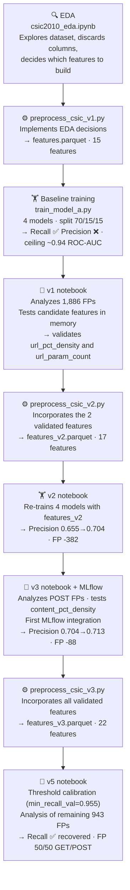

# Model A — Web Attack Detection

**Dataset:** CSIC 2010  
**Input:** HTTP request features  
**Output:** `0` normal / `1` attack

---

## Complete pipeline

Each step has a specific role in the chain. None are skipped — each one answers a different question before moving to the next.


```mermaid
flowchart TD
    A["🔍 EDA\ncsic2010_eda.ipynb\nExplores dataset, discards columns,\ndecides which features to build"]
    B["⚙️ preprocess_csic_v1.py\nImplements EDA decisions\n→ features.parquet · 15 features"]
    C["🏋️ Baseline training\ntrain_model_a.py\n4 models · split 70/15/15\n→ Recall ✅ Precision ❌ · ceiling ~0.94 ROC-AUC"]
    D["🔬 v1 notebook\nAnalyzes 1,886 FPs\nTests candidate features in memory\n→ validates url_pct_density and url_param_count"]
    E["⚙️ preprocess_csic_v2.py\nIncorporates the 2 validated features\n→ features_v2.parquet · 17 features"]
    F["🏋️ v2 notebook\nRe-trains 4 models with features_v2\n→ Precision 0.655→0.704 · FP -382"]
    G["🔬 v3 notebook + MLflow\nAnalyzes POST FPs · tests content_pct_density\nFirst MLflow integration\n→ Precision 0.704→0.713 · FP -88"]
    H["⚙️ preprocess_csic_v3.py\nIncorporates all validated features\n→ features_v3.parquet · 22 features"]
    I["🔬 v5 notebook\nThreshold calibration (min_recall_val=0.955)\nAnalysis of remaining 943 FPs\n→ Recall ✅ recovered · FP 50/50 GET/POST"]

    A --> B --> C --> D --> E --> F --> G --> H --> I
```

**Types of steps:**

| Type | Role | Lives in |
|---|---|---|
| **EDA** | Model-less exploration — decides which features to build | `notebooks/eda/` |
| **Preprocessing** | Implements EDA decisions in reproducible code | `src/mlsec/data/` |
| **Training / Experiment** | Trains models, measures metrics, analyzes errors, decides next step | `notebooks/experiments/` / `src/mlsec/models/` |

---

## MVP success criteria

| Metric | Minimum |
|---|---|
| Recall | ≥ 0.95 |
| Precision | ≥ 0.85 |

---

## Metrics progression

Evolution of the best model (RF / LightGBM) throughout the experiments:

| Version | ROC-AUC | Recall | Precision | FP | Status |
|---|---|---|---|---|---|
| Baseline | 0.939 | 0.951 | 0.655 | 1886 | ❌ |
| v2 — url_pct_density + url_param_count | 0.950 | 0.950 | 0.704 | 1504 | ❌ |
| v3 — content_pct_density | 0.955 | 0.952 | 0.713 | 1444 | ❌ |
| v4 — URL structure (GET) | 0.966 | 0.949 | 0.803 | 877 | ❌ |
| v5 — Threshold calibration | 0.966 | **0.956 ✅** | 0.792 | 943 | ❌ |
| v6 — content_param_density | 0.966 | 0.955 ✅ | 0.793 | 938 | ❌ |
| v7 — Latin-1 encoding | 0.968 | 0.953 ✅ | 0.793 | 936 | ❌ |
| **Target** | — | **0.95** | **0.85** | ~630 | — |

---

## Experiments

| Page | What it did | Result |
|---|---|---|
| [Baseline](baseline.md) | 4 models trained with 15 EDA features | Feature ceiling ~0.94 ROC-AUC |
| [v1 — Feature analysis](v1.md) | FP analysis + 4 candidate features evaluated | `url_pct_density` and `url_param_count` → validated signal |
| [v2 — URL features](v2.md) | 4 models re-trained with 17 features | Precision 0.655 → 0.704 (+0.049), FP -382 |
| [v3 — Content POST + MLflow](v3.md) | `content_pct_density`, first MLflow integration | Precision 0.704 → 0.713 (+0.012), FP -88 |
| [v4 — URL structure GET](v4.md) | `url_path_depth`, `url_query_length`, `url_has_query` | Precision 0.713 → 0.803 (+0.090), FP -567, ROC-AUC 0.966 |
| [v5 — Threshold calibration](v5.md) | `min_recall_val=0.955` — no new features | Recall 0.9492 → 0.9556 ✅, FP 877→943 (+66), Precision gap 0.047→0.058 |
| [v6 — content_param_density](v6.md) | `content_param_count / content_length` — POST subpopulation | Precision +0.0007, FP -5. Identified root cause: Latin-1 vs attack encoding confusion |
| [v7 — Latin-1 encoding](v7.md) | `content_pct_latin1_density`, `url_pct_latin1_density` | Hypothesis unconfirmed. Attacks also have Latin-1 (generated against Spanish store). FP -2 |

---

## Preprocessing pipeline

| Script | Generated dataset | Features | Change |
|---|---|---|---|
| `preprocess_csic_v1.py` | `features.parquet` | 15 + label | Original version |
| `preprocess_csic_v2.py` | `features_v2.parquet` | 17 + label | + `url_pct_density`, `url_param_count` |
| `preprocess_csic_v3.py` | `features_v3.parquet` | 22 + label | + `url_path_depth`, `url_query_length`, `url_has_query`, `content_pct_density`, `content_param_count` |
| **`preprocess_csic_v4.py`** | **`features_v4.parquet`** | **23 + label** | + `content_param_density` — **final version** |

---

## Current state — Model A concluded

**Decision (2026-04-13):** Precision ~0.793 is accepted as the practical ceiling of the current approach and moving forward to Model B.

### Journey from v5 to v7

**v5** resolved Recall: LightGBM 0.9556 ✅. Cost: +66 FP (877→943), Precision 0.7921. The optimal threshold was `min_recall_val=0.955` found via 0.950–0.985 sweep.

**v6** validated `content_param_density` (POST corr -0.216, rank 6) — marginal impact (-5 FP). Inspection of the raw CSV revealed the **root cause** of FPs:

> The model confuses **Latin-1 encoding** (Spanish accented vowels: `%F1`=n-tilde, `%ED`=i-acute, `%FA`=u-acute) with **attack encoding** (`%27`=', `%3C`=<). The `content_pct_density` feature counts all `%XX` equally. The FPs are legitimate forms from a Spanish store — surnames like `Murgu%EDa`, passwords like `lIMpi%24a%FA%F1as`.

**v7** tested `content_pct_latin1_density` and `url_pct_latin1_density` to separate harmless Latin-1 from attack encoding. **Unconfirmed hypothesis:** the CSIC 2010 attack generator builds requests against a Spanish store and includes field names with accented characters — attacks have Latin-1 at the same rate as normal traffic (POST mean: 0.00413 attack vs 0.00420 normal). POST content correlation: -0.004. FP 938→936 (-2).

### Why the ceiling is accepted

| Dimension analyzed | Result |
|---|---|
| URL/body length and structure | Exhausted since v4 |
| Keyword indicators (`%27`, `SELECT`) | 98.6% of FPs have none |
| Query string structure | Improved in v4, exhausted |
| Parameter density (`content_param_density`) | Real but marginal signal |
| Latin-1 vs attack encoding | No separation — attacks also have Latin-1 |
| HTTP headers (`cookie`, `content-type`) | No signal — constant in the dataset |

The 936 FPs are normal requests that the model cannot differentiate from attacks using individual HTTP field features. Closing the gap would require semantic parsing of parameter values or session features — a different approach than the current one.

**Final official preprocessing:** `preprocess_csic_v4.py` → `features_v4.parquet` (23 features)

### Docker — First end-to-end run (2026-04-13)

We validated the complete pipeline in Docker (`docker/docker-compose.yml`). The `dag_model_a` DAG successfully ran with all services:

```
verify_data  →  preprocess  →  train  →  evaluate
    ✅              ✅            ✅         ✅
DagRun: successful
```

**Run details:**

- Dataset: `features_v4.parquet` (23 features)
- Split: Train 42,745 / Val 9,160 / Test 9,160
- Model: LightGBM, `min_recall_val=0.955`
- Calibrated threshold: **0.2903**

**Metrics (identical to v6/v7 — the same model):**

| Metric | Value | Target |
|---|---|---|
| ROC-AUC | 0.9661 | — |
| Recall | **0.9548 ✅** | ≥ 0.95 |
| Precision | 0.7928 | ≥ 0.85 |
| FP | 938 | ~630 |

**MLflow integration:**

- Run `model-a-lightgbm-pipeline` logged in experiment `mlsec-model-a`
- Model artifact saved in `mlflow-artifacts` (shared Docker volume)
- Params: `n_estimators=200`, `min_recall_val=0.955`, `threshold=0.2903`, `n_features=23`
- Metrics: `test_recall`, `test_precision`, `test_roc_auc`, `test_fp`

**Active services:**

| Service | Port | URL |
|---|---|---|
| Airflow webserver | 5080 | http://localhost:5080 |
| MLflow tracking | 5081 | http://localhost:5081 |
| Postgres | 5432 | shared backend |

---

### Next step

→ **Model B** — Network Attack Detection (UNSW-NB15). EDA completed, preprocessing and training pending.
